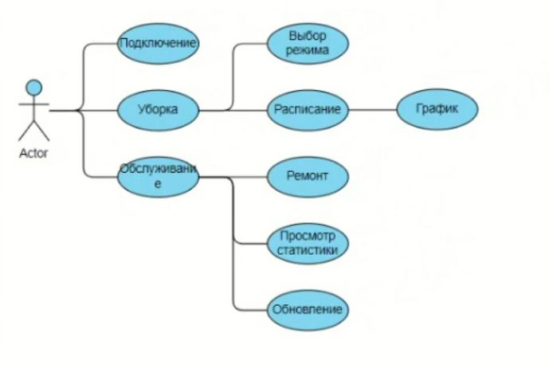
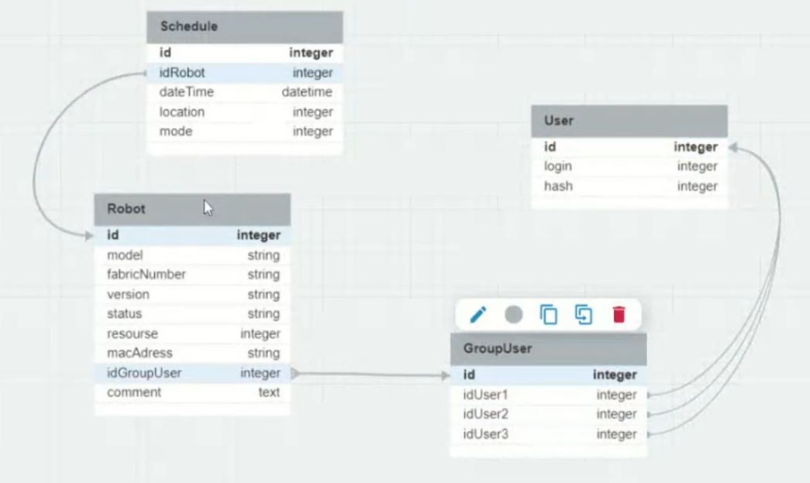
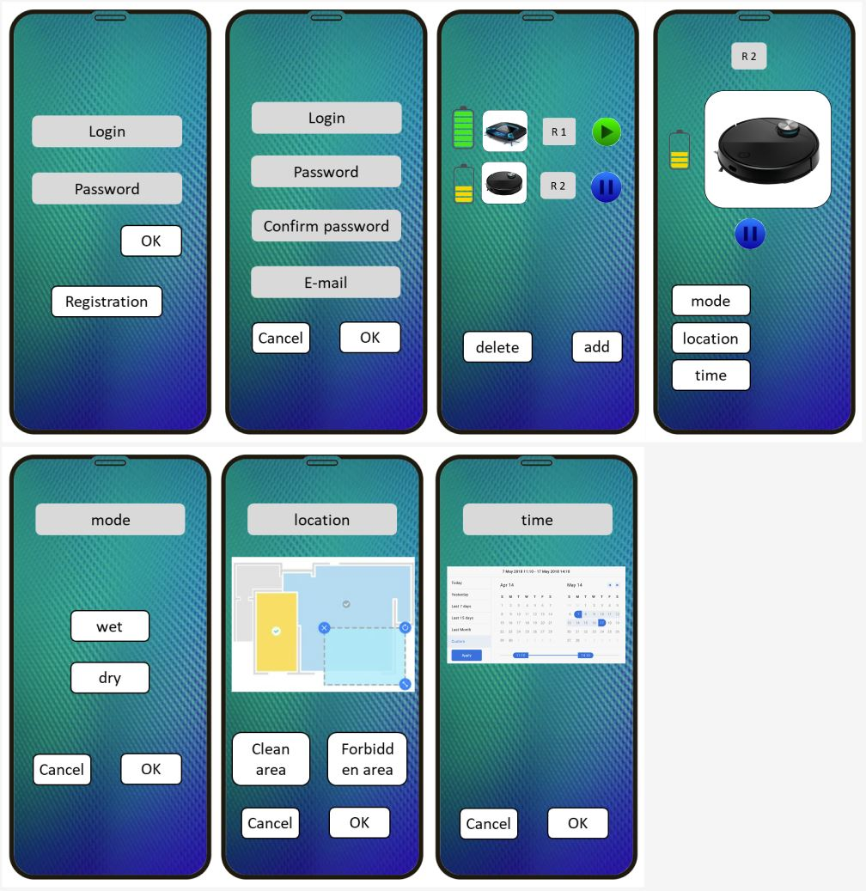

HomeWork 10 . 

Блок 1 / Семинар 10
Задание:
a. Спроектировать пользовательский интерфейс (web-SPA, native mobile), основные компоненты (подключение робота, управление помещениями, расписание работы, сервисное обслуживание робота, история уборок), https://www.figma.com/  или https://app.diagrams.net/.
b. Спроектировать доменную модель, в виде текста Домен – атрибуты.
c. Спроектировать сценарии (Use case)(подключение, выбор помещения, программы уборки, настройка расписания, просмотр статистики..), в виде Актор – Прецедент (из первой лекции).
d. Спроектировать слой  API Gateway (mobile, web), сформировать REST запросы: GET, POST, PUT, DELETE (https://swagger.io).
(дополнительно, по желанию) Разработать REST контракты API между компонентами и сгенерировавать (автоматически на ресурсе https://swagger.io) код на разных языках программирования.
e. Спроектировать компоненты бизнес-логики и связать их API Gateway с применением паттерна BFF https://app.diagrams.net/.
f. Определить состав информации для кеширования на уровне приложения пользователя, API Gateway, уровня бизнес-логики и уровня репозитория. Список.
g. Спроектировать ER модель (https://www.dbdesigner.net/), запросы в БД и уровень хранения данных (СУБД).
Домашнее задание:
Доработать пункты задания Блока 1: a, b, c, d, e, f, g.
Инструменты:
https://www.figma.com/
https://app.diagrams.net/
https://www.dbdesigner.net/
https://swagger.io

